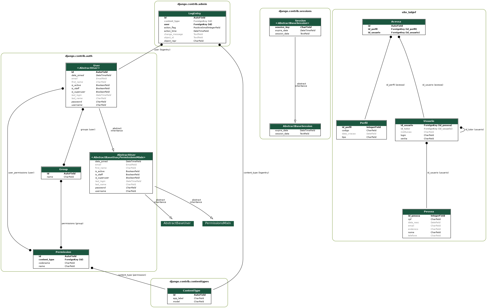

# Trabalho de merda

# aqui começa o readme real oficial

## How to setup docker

- Run `docker-compose build`. This will install all necessary dependencies for the project.
- Run `docker-compose up` to the first run of the system/server (this is when postgresql container will be set). As soon as the process finishes your can issue `CTRL+C` to stop the server.
- Run `docker-compose run web python manage.py migrate && docker-compose run web python manage.py makemigrations && docker-compose run web python manage.py migrate` to setup database tables.
- Create a superuser for the system with the command `docker-compose run web python manage.py createsuperuser`.
- That's it! Now just run `docker-compose up` and access [http://0.0.0.0:8000/laboratorio](http://0.0.0.0:8000/laboratorio).

- Additionally you can run `cat ./data.sql | docker exec -i /labjef_db_1 psql -U postgres -d postgres` to populate the database with default data.

# aqui termina o readme real oficial

## Docker setupping

- Para criar o docker com django/postgressql usei [este tutorial](https://docs.docker.com/compose/django/).
- Primeiro comando executado `sudo docker-compose run web django-admin startproject project .`, com isso criei o projeto em si
- Pra rodar o bixo basta invocar `docker-compose up` e acessar [http://0.0.0.0:8000/](http://0.0.0.0:8000/)
- Sempre que quisermos invocar algum comando do _django_ podemos fazer com `docker-compose run web <comando>`
- Invocar `docker-compose build` se eu quiser instalar mais alguma porrinha do _requirements.txt_
- (talvez não seja tão seguro rodar isso) Tem que dar `sudo chown -R $USER:$USER .` pra arrumar as permissões das coisas que são criadas dentro do docker

## Django stuff 

- Aqui comecei a seguir [o tutorial do próprio João Goulart](https://docs.djangoproject.com/en/3.0/intro/tutorial01/).
- Para criar o site dentro do projeto, executei `docker-compose run web python manage.py startapp laboratorio`
- Talves [este link tenha que ser visitado depois com os models](https://stackoverflow.com/questions/33992867/how-do-you-perform-django-database-migrations-when-using-docker-compose)

## DB stuff

- Inserindo na classe pai caso ela não exista vai ser feito [usando isso](https://stackoverflow.com/questions/4069718/postgres-insert-if-does-not-exist-already)
- A herança [pode ser vista aqui](https://www.postgresql.org/docs/10/tutorial-inheritance.html)
- Talvez oq a gente va fazer é chamado de [partitioning](https://zaiste.net/posts/table-inheritance-partitioning-postgresql/)
