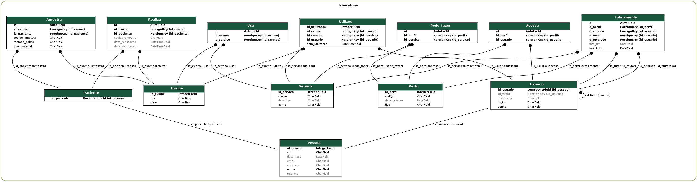

# Laboratory web application

This project is made for the discipline MAC0350 Introduction to the Development of Software Systems @ IME-USP 2020. We modeled a complete database scheme for a laboratory and used the [Django framework](https://www.djangoproject.com/) to build a web application for it.

## How to setup docker

- Run `docker-compose build`. This will install all necessary dependencies for the project.
- Run `docker-compose up` to the first run of the system/server (this is when postgresql container will be set). As soon as the process finishes your can issue `CTRL+C` to stop the server.
- Run `docker-compose run web python manage.py migrate && docker-compose run web python manage.py makemigrations && docker-compose run web python manage.py migrate` to setup database tables.
- Create a superuser for the system with the command `docker-compose run web python manage.py createsuperuser`.
- That's it! Now just run `docker-compose up` and access [http://0.0.0.0:8000/laboratorio](http://0.0.0.0:8000/laboratorio).

- Additionally you can run `cat ./data.sql | docker exec -i /labjef_db_1 psql -U postgres -d postgres` to populate the database with default data.

## Visualizing database

- To generate the SQL script of the database creation run `docker-compose run web python manage.py sqlmigrate laboratorio 0001 > create_database.sql`
- To generate a relational model of the database tables run `docker-compose run web python manage.py graph_models laboratorio -o relational.png`
